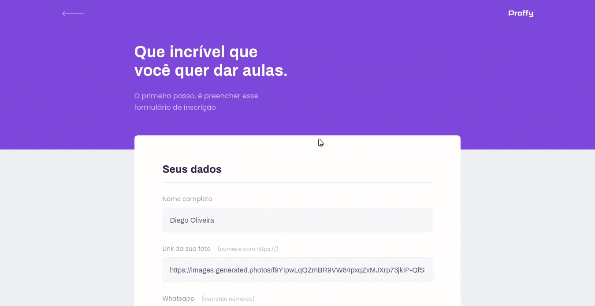

<div align="center" >
  
</div>
<br>

## 💻 Demo
<div align="center" >
  <h2 align="center">Página web responsiva</h2>
  
  <br>


  <h2 align="center">Estudar</h2>
  
  <br>

  <h2 align="center">Dar Aulas</h2>
  
  <br>

</div>

## 🛠 Tecnologias

Esse projeto foi desenvolvido com as seguintes tecnologias:

- HTML
- CSS
- Javascript

<p align="left">
  
  
  
</p>

## 📜 Projeto

Proffy é uma plataforma de estudos online. Desenvolvida durante o NLW da Rocketseat.

### 📚 Pré-requisitos

Antes de começar, você vai precisar ter instalado em sua máquina as seguintes ferramentas:
[Git](https://git-scm.com), [Node.js](https://nodejs.org/en/).
Além disto é bom ter um editor para trabalhar com o código como [VSCode](https://code.visualstudio.com/)

### ⚙️ Rodando o Web

```bash
# Clone este repositório
$ git clone https://github.com/Brenerr/Proffy

# Acesse a pasta do projeto no terminal/cmd
$ cd Proffy

# Instale as dependências
$ yarn
# ou
$ npm install

# Execute a aplicação em modo de desenvolvimento
$ npm run dev

